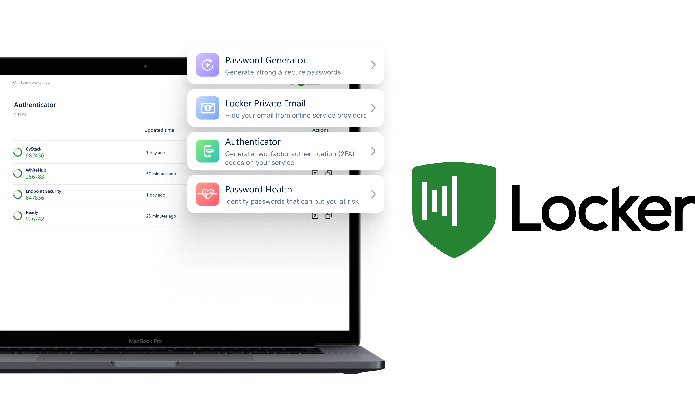

Locker is a password manager that goes beyond the mere concept of password management. Locker stores your sensitive data, logs you into your favourite sites, scans for data breaches, and more. Every feature in Locker is built on the foundation of privacy and transparency to ensure the highest security for users.

## What is Locker?

Locker Password Manager (also referred to as Locker) is a cross-platform password management solution: Locker can be used as a Web, Mobile, Browser Extension, and Desktop application.

Locker is designed to help users and organizations manage their confidential data, especially login credentials, including passwords. To be able to access and decrypt the data in Locker, users need to memorize **ONLY** one item: their **Master Password**.

## The Developer - CyStack

Locker Password Manager was developed by CyStack, one of the leading cybersecurity companies in Vietnam. CyStack is a member of the Vietnam Information Security Association (VNISA) and the Vietnam Association of CyberSecurity Product Development. CyStack is a partner providing security solutions and services for many enterprises.

CyStack's research has been featured at the world’s top security events, such as BlackHat USA (USA), BlackHat Asia (Singapore), T2Fi (Finland), XCon - XFocus (China), etc. CyStack's findings have been acknowledged by global corporations such as Microsoft, Dell, Deloitte, D-link, etc.

## Awards and Recognitions

Locker received the Vietnam Golden Key Award for excellent cybersecurity products in 2021.

## Whitepaper

[Locker Whitepaper](https://locker.io/whitepaper)

## Contribute

Code contributions are welcome! You can commit any pull requests against the `main` branch. Learn more about how to contribute by reading the [Contributing Guidelines](CONTRIBUTING.md) 

## Security
We run a bug bounty program on [WhiteHub](https://whitehub.net/programs/locker). If you find any flaws related to the design, implementation, and infrastructure of Locker, please report them to WhiteHub, and we will triage them as soon as possible.
